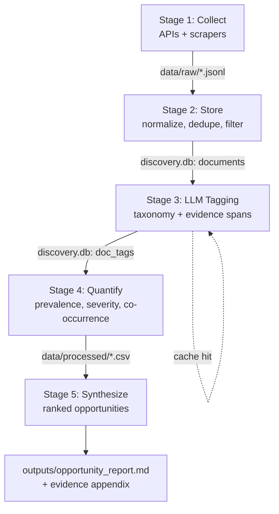

# Architecture — AJIO Wishlist-to-Purchase Discovery Engine

This document specifies the technical design of the discovery pipeline described in `problemStatement.md`. It is the implementation contract: file layout, data schemas, stage responsibilities, scoring math, and run order.

---

## 1. Design principles

| Principle | How it is enforced |
| --- | --- |
| Raw data is immutable | Collectors only ever append to `data/raw/`; no later stage writes there |
| Re-runnable without re-scraping | Every stage reads the previous stage's on-disk artifact, never the network |
| Deterministic where possible | Temperature 0, pinned model string, fixed seeds, versioned prompts and taxonomy |
| Every number traces to a quote | Tags store evidence spans; aggregates store the document ids that produced them |
| A crowd is never counted as a voice | Site-published aggregate numbers are read only by Stage 5 and never become documents, because one row summarising hundreds of raters would be weighted like one person — see §5.1 |
| No monetary framing | Blocker taxonomy separates `price_absolute` from non-monetary friction so scoring can down-weight what we cannot act on |
| Secrets never in code | All credentials read from `.env` via `python-dotenv` |
| The host's encoding never decides behavior | Hand-saved files are decoded by BOM detection, not assumed UTF-8; `stdout`/`stderr` are forced to UTF-8 at every entry point. Both directions live in `src/common/encoding.py` — see §2.1 |

---

## 2. Repository layout

```
Ajio Discovery Engine/
├── .env                          # secrets (gitignored)
├── .env.example                  # documented key names, no values
├── .gitignore
├── requirements.txt              # pinned versions
├── config.yaml                   # non-secret run config (source of truth)
├── problemStatement.md           # the brief
├── architecture.md               # this document
├── implementation-plan.md        # phase-by-phase build plan
├── edge-case.md                  # prioritised failure modes
│
├── scripts/
│   ├── check_credentials.py      # live probe per provider; pass/fail table
│   ├── verify_sources.py         # one live page per configured URL, parsed by its own parser
│   ├── audit_collection.py       # Phase 2 exit criteria scored from files
│   ├── measure_token_overhead.py # observed reasoning/output cost per model
│   ├── build_tag_sample.py       # seeded census+proportional draw into tag_sample; §7.3
│   ├── audit_rejected_pool.py    # draws/scores the rejected-pool audit; §3.1
│   └── manual_extract/           # bookmarklets + CDP-to-real-Chrome + ajio_bars.js; not imported by Collect
│
├── config/
│   ├── relevance_keywords.txt    # tier-1 triage vocabulary
│   └── tag_cues.yaml             # per-tag cue lexicon for the attribution screen
│
├── src/
│   ├── common/
│   │   ├── config.py             # loads .env + config.yaml into typed settings
│   │   ├── schemas.py            # RawRecord, Document, DocumentTags, SOURCE_STAGE
│   │   ├── db.py                 # SQLite connection, migrations, upserts
│   │   ├── hashing.py            # doc_id, author pseudonymization, simhash fingerprints
│   │   ├── encoding.py           # BOM-aware file reads; UTF-8 forced on stdout/stderr
│   │   └── logging.py            # structured run logs, UTF-8 forced
│   │
│   ├── collect/                  # STAGE 1 — one module per source
│   │   ├── base.py               # Collector ABC: fetch() -> Iterator[RawRecord]
│   │   ├── scraping.py           # shared robots.txt gate, polite fetch, retries
│   │   ├── manual.py             # shared loader/validator for the two hand-collected dirs
│   │   ├── play_store.py
│   │   ├── app_store.py
│   │   ├── youtube.py
│   │   ├── ajio_onsite.py        # on-platform product reviews + Q&A
│   │   ├── ajio_manual.py        # hand-collected AJIO Q&A/reviews; never fetches
│   │   ├── mouthshut.py
│   │   ├── trustpilot.py
│   │   ├── complaints_board.py
│   │   ├── consumer_complaints_in.py
│   │   ├── quora_manual.py       # reads pasted threads from disk; never fetches
│   │   ├── reddit.py             # retained but disabled by default
│   │   └── run_collection.py     # CLI entrypoint, writes data/raw/
│   │
│   ├── store/                    # STAGE 2
│   │   ├── normalize.py          # RawRecord -> Document
│   │   ├── exclusions.py         # the three hard exclusion rules, first match wins
│   │   ├── dedupe.py             # exact + near-duplicate removal
│   │   ├── relevance.py          # cheap pre-filter before LLM spend
│   │   ├── aggregates.py         # AJIO's own rating/fit/quality numbers — NOT documents; §5.1
│   │   └── build_corpus.py       # CLI entrypoint, writes discovery.db
│   │
│   ├── tag/                      # STAGE 3
│   │   ├── taxonomy.py           # versioned enum definitions
│   │   ├── prompts/
│   │   │   └── tagging_v1.md     # versioned prompt template
│   │   ├── llm_client.py         # retries, rate limits, token accounting
│   │   ├── cache.py              # keyed by (doc_id, prompt_version, taxonomy_version, model)
│   │   └── run_tagging.py        # CLI entrypoint, writes tags into discovery.db
│   │
│   ├── quantify/                 # STAGE 4
│   │   ├── metrics.py            # prevalence, severity, confidence, Wilson intervals
│   │   ├── cooccurrence.py       # blocker × uncertainty × segment matrices
│   │   ├── scoring.py            # opportunity score
│   │   └── run_quantification.py # CLI entrypoint, writes data/processed/*.csv
│   │
│   └── synthesize/               # STAGE 5
│       ├── evidence.py           # pulls representative verbatims per opportunity
│       ├── ajio_aggregates.py    # the only consumer of data/aggregates/; §5.1
│       ├── limitations.py        # the Limitations section; hand-collection caveat
│       ├── report.py             # renders markdown report from templates
│       └── run_synthesis.py      # CLI entrypoint, writes outputs/
│
├── data/
│   ├── manual/quora/*.{jsonl,json,txt,md}  # hand-saved Quora threads (no crawling)
│   ├── manual/ajio/*.{txt,md}              # hand-saved AJIO Q&A + reviews (no crawling)
│   ├── aggregates/ajio/<product_id>.json   # AJIO-published numbers; read by Stage 5 only
│   ├── raw/<source>/<run_date>/*.jsonl     # immutable
│   ├── raw/_compliance/                    # cached robots.txt per domain + decision log
│   ├── interim/discovery.db                # SQLite: documents + tags + cache
│   └── processed/*.csv                     # aggregate tables
│
├── logs/<run_id>.log
│
├── outputs/
│   ├── opportunity_report.md
│   ├── opportunity_scores.csv
│   ├── segment_matrix.csv
│   ├── evidence_appendix.md
│   └── tagger_validation.md
│
└── tests/
    ├── test_config.py
    ├── test_schemas.py
    ├── test_strict_schema.py
    ├── test_hashing.py
    ├── test_db.py
    ├── test_exclusions.py
    ├── test_dedupe.py
    ├── test_encoding.py
    ├── test_manual_import.py     # the shared loader; asserts no fixture reaches data/manual/
    ├── test_aggregates.py        # derived averages, tolerant loading, and the §5.1 wall
    ├── test_synthesize_aggregates.py
    ├── test_tag_sample.py        # the draw is reproducible, proportional, and additive; §7.3
    ├── test_rejected_audit.py    # strata, the seeded draw, and a gate that can fail; §3.1
    ├── test_scoring.py
    └── gold/gold_set.jsonl       # 100 hand-labeled docs for tagger validation
```

`data/`, `logs/`, and `outputs/` are gitignored: they are regenerable, large, and contain personal text from public posts.

### 2.1 Encoding boundaries

Two boundaries in this pipeline meet the host's legacy codepage rather than UTF-8, and on Windows that is cp1252. The failures look unrelated, share a cause, and are handled by one module (`src/common/encoding.py`) with one function per direction. Both were found by running real data, not by review.

**Reading files a human saved.** Every other input is machine-written and reliably UTF-8; the exceptions are the manual AJIO and Quora imports and the relevance keyword list. Editors on Windows prepend a UTF-8 BOM, and PowerShell's `>` and `Out-File` produce UTF-16LE. `read_text_tolerant()` selects the codec from the byte-order mark, because reading such a file as plain UTF-8 **succeeds** — and that is the problem. A BOM decodes cleanly into an invisible U+FEFF on the first line, so a pattern anchored at line start silently stops matching, and the parser reports a content error for what is an encoding error. Observed: a manual import of 3 records yielded 0, with four warnings that all named the wrong cause. The quietest instance is the keyword vocabulary, where a BOM disables the first term with no warning at all, since `str.strip()` does not remove U+FEFF.

**Writing our own output.** The mirror image, and it fails loudly and late instead of silently. `print` raises `UnicodeEncodeError` on any character the stream's codec lacks, so a stage can complete all its work, commit it, and still exit non-zero — which is what happened to `build_corpus` on the single `⚠` in its funnel report. `harden_stdio()` forces UTF-8 on `stdout` and `stderr`; `setup_logging()` calls it ahead of its own idempotence guard, which makes every entry point safe by construction since each one configures logging first. Operator-facing warning markers are nonetheless plain ASCII: forcing UTF-8 means emitting bytes a cp1252 console will render as mojibake, and the lines a human must not misread should not depend on the terminal.

The general shape is worth keeping in mind for anything added later: an encoding bug on the way in tends to look like a data-quality bug, and one on the way out tends to look like a crash in unrelated code.

---

## 3. Data flow



---

## 4. Stage 0 — Configuration

**`config.yaml` is the single source of truth for run configuration.** It is deliberately not reproduced in full here, because a second copy in prose drifts from the real file. Read `config.yaml` for exact values; this section documents its shape and the decisions encoded in it.

| Block | Contains | Notes |
| --- | --- | --- |
| `model` | provider, pinned tagger and triage models, temperature, seed, response format, reasoning effort, batch sizes, token caps | Changing `name`, `docs_per_request` semantics, or the prompt/taxonomy version invalidates the tag cache |
| `rate_limits` | per-model RPM / RPD / TPM / TPD for `tagging` and `triage` | RPD and TPM confirmed from live `x-ratelimit-*` headers; TPD is not header-exposed and is tracked locally |
| `collection` | one block per source, each with an `enabled` flag, plus shared politeness settings | Sources are grouped by purchase stage; see §5 |
| `filters` | the hard exclusions and dedup thresholds | `min_words: 3` (revised down from 8 — see §3), `language_min_words: 8`, `exclude_emoji: true`, `excluded_languages: [hi]`. `near_duplicate_hamming` is calibrated, not conventional — see §6 |
| `evidence` | attribution screen thresholds and the evidence-precision gate | `max_quote_span_ratio`, `max_tags_per_quote`, `min_evidence_precision`; added in Phase 4 alongside the screen itself (§7.2) |
| `quantification` | recency half-life, low-confidence floor, minimum distinct authors, per-author caps | Guards against one prolific author manufacturing a finding |
| `paths` | raw, aggregates, interim, processed, outputs, logs | Resolved against the project root, never the working directory. `aggregates_dir` is deliberately excluded from `ensure_dirs()`, so Collect never creates or touches it — see §5.1 |

Every source block carries `enabled`, so a source can be switched off without deleting its configuration. `CollectionConfig.enabled_sources()` is the single place that answers "what are we collecting from". The config models use `extra="forbid"`, so a typo in `config.yaml` fails at startup instead of being silently ignored.

`.env` holds only credentials, split by whether a run can start without them:

```
# required
GROQ_API_KEY=
YOUTUBE_API_KEY=
HASH_SALT=

# optional — only for sources disabled by default
REDDIT_CLIENT_ID=
REDDIT_CLIENT_SECRET=
REDDIT_USER_AGENT=
```

`get_settings()` raises `MissingConfigError` naming every absent *required* key. Absent optional keys are reported but never block a run; a source that is enabled without its credentials fails the credential check with a message naming both the flag and the keys.

---

## 5. Stage 1 — Collection

**Contract.** Each collector implements `base.Collector`:

```python
class Collector(ABC):
    source: str                                  # "play_store" | "reddit" | ...
    @abstractmethod
    def fetch(self, cfg: SourceConfig) -> Iterator[RawRecord]: ...
```

**Output.** Newline-delimited JSON at `data/raw/<source>/<run_date>/part-000.jsonl`, one `RawRecord` per line:

```json
{
  "source": "ajio_onsite",
  "source_native_id": "qa-441029-17",
  "url": "https://www.ajio.com/...",
  "author_raw": "someuser",
  "created_utc": "2026-05-11T08:14:00Z",
  "text": "...",
  "meta": {"product_id": "441029", "content_type": "qa", "rating": null, "brand": "..."},
  "collected_at": "2026-08-18T17:30:00Z",
  "collector_version": "1.0.0"
}
```

**Per-source notes.** Sources are grouped by *purchase stage*, because that determines what a source can tell us. The North Star metric is about pre-purchase hesitation, so post-purchase sources are supporting evidence rather than the primary lens.

| Source | Stage | Access method | Key fields captured in `meta` |
| --- | --- | --- | --- |
| AJIO on-site Q&A | **pre-purchase** | `requests` with browser-grade headers, but an Akamai edge refuses even those; `ajio_manual` is the fallback | product_id, content_type=`qa`, brand, category |
| YouTube comments | **pre-purchase** | Data API v3 `commentThreads` | video_id, video_title, like_count, channel |
| Quora | **pre-purchase** | **manual import only** — JSON/JSONL or pasted files dropped in `data/manual/quora/`; extract snippet under `scripts/manual_extract/`. **Filled 2026-08-23:** 204 answers across 10 threads | thread_title, question, answer_index, extraction |
| AJIO manual import | **pre/post** (by `content_type`) | **manual import only, and `enabled: false`** — AJIO publishes no review or Q&A prose anywhere on site, so there is nothing to hand-collect. Loader, collector, fixtures and file format retained; what the site *does* publish is read as aggregates instead (§5.1) | product_id, content_type, product_title, extraction |
| AJIO on-site reviews | post-purchase | as above | product_id, content_type=`review`, rating, size_bought, fit_feedback |
| Play Store | mixed | `google-play-scraper` | rating, thumbs_up, app_version, reply |
| App Store | mixed | iTunes RSS customer-reviews JSON — yielded 0 on the live run and recorded `zero_yield`; not re-probed since | rating, title, app_version |
| MouthShut | post-purchase | `requests` + `beautifulsoup4` — **disabled**: the correct listing renders its review list client-side, so no selector set can reach it | rating, review_title, listing_url |
| ComplaintsBoard | post-purchase | `requests` + `beautifulsoup4` | complaint_title, status, company_path |
| ConsumerComplaints.in | post-purchase | `requests` + `beautifulsoup4` | complaint_title, status, company_path |
| Trustpilot | post-purchase | robots.txt disallows `/reviews/`; expect near-zero compliant yield | rating, domain |
| Reddit | pre-purchase | `praw` (script app, read-only) — **disabled by default** | subreddit, score, num_comments, is_comment, parent_id |

**Stage balance is a first-class concern.** Most of this roster is post-purchase, and complaint boards in particular are dominated by delivery and refund grievances that say nothing about why a wishlisted item was never bought. Two safeguards: the corpus summary in Stage 5 reports the pre/post split explicitly, and opportunity scoring weights source spread so a finding present only in complaint sources cannot dominate the ranking.

**Measured across the live runs, the balance inverted — and the problem changed shape rather than going away.** The first run (2026-08-20) yielded 12,702 raw records, of which YouTube's 4,494 pre-purchase records became 180 pre-purchase documents, leaving 73% of the analyzable corpus as `mixed` Play Store reviews. Widening the YouTube query terms and lowering `min_words` from 8 to 3 (§6) took the corpus to **55,731 raw records and 26,539 surviving documents, 21,783 of them pre-purchase** — 82%. The 2026-08-24 Quora import then raised those to **55,913 / 26,718 / 21,962**, of which 179 documents are Quora. The safeguards above are still necessary but still not sufficient, because the risk is no longer *skew*, it is **concentration**: YouTube is still 99.2% of pre-purchase documents (and 98.0% of *relevant* pre-purchase: 5,336 of 5,443), so YouTube-specific bias (haul-video audiences, comment-section self-selection, influencer framing) still propagates to almost the whole pre-purchase claim. The 107 relevant Quora answers in `discovery.db` are the first non-YouTube pre-purchase evidence in the project, and they exist to break the monoculture rather than to move a floor. A floor stated in raw records could catch none of this; see §11 and `implementation-plan.md` §3.3.

**Compliance.** `robots.txt` is fetched and honored per domain before any request, and a source that disallows its content paths is skipped with a logged reason rather than worked around. Two sources are deliberately implemented as offline importers. Quora's `robots.txt` prohibits bots from using its content for AI or ML systems, so it is read only from files a human saved. AJIO is a different case: its content paths are permitted by `robots.txt` but refused by an Akamai edge that fingerprints the *automated* client, and the project treats that refusal as the site's access decision rather than something to defeat. `ajio_manual` was written to stand in for the blocked on-site collector and cannot: there is no prose behind the block for either route to reach, so the source is disabled and the site's published aggregates are read separately instead (§5.1). The supported fill paths are a console snippet on a page a person already scrolled, or Playwright connected over CDP to that already-open Chrome profile; both live under `scripts/manual_extract/` and are not imported by Collect. Spawning headless Chromium is the fingerprint that gets blocked. Both importers make no network calls, and `ajio_manual` additionally refuses to import the on-site collector, which owns the HTTP session. Only publicly visible content is collected; nothing behind a login.

**Idempotency and manifests.** Each run writes `data/raw/<source>/<run_date>/_manifest.json` with the config hash, record count, and time window covered. Re-running the same date range skips a source if a manifest already exists unless `--force` is passed. This is what makes the "re-runnable without re-scraping" guarantee real.

**Politeness.** Fixed per-domain delays, exponential backoff via `tenacity`, and a hard per-run request budget.

### 5.1 The AJIO aggregate side-channel — numbers that are never documents

AJIO publishes no free-text reviews and no Q&A anywhere on site (`edge-case.md` §1.1.13f), which is why `ajio_manual` is disabled. What it *does* publish on a product page is a star-rating distribution and fit/quality percentage breakdowns. Those are worth having, and they are worth keeping strictly outside the corpus.

**The reason for the wall is arithmetic, not tidiness.** A document is one person saying one thing, and every metric downstream counts people: prevalence, distinct-author share, per-author caps (§8). One aggregate row summarises hundreds of raters, so admitting it as a document would weight a crowd like an individual and inflate whatever it agreed with — invisibly, because a number that validates as a record produces no funnel loss for anyone to notice. Read *beside* the corpus instead, the same row is a genuine cross-check: AJIO's own buyers on fit, next to what the text says about fit.

| | |
| --- | --- |
| On disk | `data/aggregates/ajio/<product_id>.json`, one object per product, from a browser grabber run against a page a person opened |
| Sole reader | `src/store/aggregates.py` |
| Sole consumer | `src/synthesize/ajio_aggregates.py` (Stage 5, §9) |
| Not | a collect source, a `RawRecord`, a `Document`, a tag, or an input to dedupe, relevance, tagging or quantification |

`ajio_aggregate` is absent from `SOURCE_STAGE`, `KNOWN_SOURCES`, `STAGE_BY_CONTENT_TYPE`, the collector registry, `run_collection` and the audit's source counts, and it has no manifest and no `data/raw` partition. That absence is asserted by a test rather than trusted, and so is the import graph of both modules: the reader may not import `src.collect.*`, `src.tag.*` or the corpus builders, and the consumer may not import tagging or quantification. The failure being guarded against is a convenience import someone adds later — reusing a loader in `build_corpus`, say — after which the corpus absorbs the numbers with no visible step.

**Two properties of the numbers themselves shape the reader.**

*The average is usually derived, and which it is must be disclosed.* AJIO reports the rater count and the distribution but not the mean in any of the 51 files collected so far, so `AjioAggregate` derives one as the weighted mean of the star buckets and records the provenance in `average_rating_source` (`reported` / `distribution` / `None`). It fills the field only when it is empty and never overwrites a captured value. A derived average is a weaker claim than a published one and the report is required to say which it is quoting (§9).

*The buckets do not sum to 100.* AJIO rounds each bucket independently, so across the current files they sum to 96–100 with a median of 97. The derived mean therefore divides by the buckets' actual sum, not by 100 — dividing by 100 would treat the rounding shortfall as ratings of zero stars, which cannot exist on a 1–5 scale, and would drag every average down by about 0.1 in the same direction. That is exactly the kind of quiet one-sided bias a report cannot disclose, because nothing records that it happened.

**A bad grab costs itself and nothing else.** Two failure shapes were observed while collecting — a 0-byte file, and two JSON objects concatenated by a grabber that ran twice into the same path — so `scan_ajio_aggregates` skips and warns per file rather than failing the batch. Fifty good products must not be lost to one bad one; it is the same blast-radius rule the manual loader needed. Identity is the `product_id` and recency wins on `extracted_at`, so re-grabbing a product is safe. A record with no `product_id` is refused outright, because unattributable numbers would carry a dead citation URL into the report.

**One caveat this layer cannot fix, now closed as far as it can be.** The grabber is committed — `scripts/manual_extract/ajio_bars.js` and its bookmarklet build, alongside the two prose extractors — so the procedure is versioned and reviewable. What that does *not* buy is a rebuild: it runs in a logged-in browser on pages a person chose, so `data/aggregates/` is **method-reproducible but not command-reproducible**, and re-running it yields a fresh snapshot over a fresh product selection rather than byte-identical files. AJIO's counts move daily, so this is a property of the source, not of the tooling. It therefore stops being a gap in the reproducibility gate (§11) and becomes a disclosure: `src/synthesize/limitations.py` states it, with the snapshot date range read from the records rather than typed in.

---

## 6. Stage 2 — Storage and corpus construction

**Normalization.** `RawRecord -> Document` assigns a stable synthetic id and strips PII-ish identifiers:

- `doc_id = sha256(source + "|" + source_native_id)[:16]`
- `author_hash = sha256(source + "|" + author_raw + SALT)[:16]` — the raw handle is never persisted, but the hash still allows per-author aggregation so one prolific poster cannot inflate a finding.
- `text_fingerprint = simhash(normalized_text)` for near-duplicate detection — a 64-bit bigram simhash over `hashlib.blake2b`, implemented in `src/common/hashing.py`. Not a library: `datasketch` offers only MinHash/LSH, which measure Jaccard similarity and expose no bitwise fingerprint to take a Hamming distance over. Not Python's `hash()` either, which is per-process randomized and would silently change duplicate decisions between runs.

**SQLite schema** (`data/interim/discovery.db`):

```sql
CREATE TABLE documents (
    doc_id            TEXT PRIMARY KEY,
    source            TEXT NOT NULL,
    source_native_id  TEXT NOT NULL,
    url               TEXT,
    author_hash       TEXT,
    created_utc       TEXT,
    text              TEXT NOT NULL,
    lang              TEXT,
    char_len          INTEGER,
    meta_json         TEXT,
    text_fingerprint  TEXT,
    is_duplicate_of   TEXT REFERENCES documents(doc_id),
    word_count        INTEGER,
    exclusion_reason  TEXT,            -- too_short | contains_emoji | hindi_language | NULL
    relevance_score   REAL,
    is_relevant       INTEGER,
    ingested_at       TEXT,
    UNIQUE (source, source_native_id)
);

CREATE TABLE doc_tags (
    doc_id            TEXT NOT NULL REFERENCES documents(doc_id),
    taxonomy_version  TEXT NOT NULL,
    prompt_version    TEXT NOT NULL,
    model             TEXT NOT NULL,
    tags_json         TEXT NOT NULL,   -- validated DocumentTags payload
    tagged_at         TEXT,
    PRIMARY KEY (doc_id, taxonomy_version, prompt_version, model)
);

CREATE TABLE llm_cache (
    cache_key         TEXT PRIMARY KEY,  -- sha256(doc_id|prompt_version|taxonomy_version|model)
    response_json     TEXT NOT NULL,
    prompt_tokens     INTEGER,
    completion_tokens INTEGER,
    reasoning_tokens  INTEGER,
    created_at        TEXT
);

CREATE TABLE run_log (
    run_id     TEXT, stage TEXT, config_hash TEXT,
    started_at TEXT, finished_at TEXT, records_in INTEGER,
    records_out INTEGER, notes TEXT
);

-- Tier-2 triage verdicts. Deliberately has NO foreign key to documents: triage
-- runs before the rebuild's insert and --force deletes every documents row, so an
-- FK would either reject the write or cascade the cache away -- and outliving a
-- --force rebuild is the whole point. doc_id is derived from
-- (source, source_native_id) and stable across rebuilds. See §3.1.
CREATE TABLE triage_cache (
    doc_id          TEXT NOT NULL,
    model           TEXT NOT NULL,
    prompt_version  TEXT NOT NULL,
    is_relevant     INTEGER NOT NULL,
    decided_at      TEXT,
    PRIMARY KEY (doc_id, model, prompt_version)
);

-- Optional, and created by scripts/build_tag_sample.py rather than by init_db.
-- Absent or empty means "tag every relevant document", which is what the tagger
-- did before this table existed. See §7.3.
CREATE TABLE tag_sample (
    doc_id  TEXT PRIMARY KEY,
    source  TEXT,
    drawn   TEXT
);
```

`UNIQUE (source, source_native_id)` plus `INSERT ... ON CONFLICT DO NOTHING` makes ingestion idempotent: re-running collection and rebuilding the corpus cannot create duplicate rows.

**`tag_sample` is a side table, and deliberately not a column on `documents`.** It records which documents a budget-constrained tagging run will cover. The cheaper-looking alternative — setting `is_relevant = 0` on everything the run cannot afford — would store a *budget* decision in the column that records a *triage* decision, after which no later reader could tell "the triage judged this irrelevant" from "we could not afford to tag it", and the funnel would report a corpus that shrank for reasons it cannot name. Keeping the sample beside the corpus rather than inside it means the funnel still says 7,127, the sample says 800, and the report can quote both. It is also why the table is not in `db.SCHEMA_SQL`: the tagger treats *absent* as "tag everything", so absent has to remain a state that actually occurs.

**Purchase stage is derived, not stored.** A single `SOURCE_STAGE` mapping in `src/common/schemas.py` classifies each source as `pre_purchase`, `post_purchase`, or `mixed`, per the table in §5. It is deliberately derived rather than a column so that reclassifying a source does not require rewriting rows. The exception is the two AJIO sources — on-site and manual import — where reviews and Q&A share a source but sit on opposite sides of the purchase: those are separated by `meta.content_type` (`qa` is pre-purchase, `review` is post-purchase), which is why conflating them is a P0 error in `edge-case.md` §1.1.14. Both AJIO sources share one `content_type`→stage mapping so the scraped and hand-collected paths cannot drift apart on it.

**Deduplication.** Two passes — exact match on `text_fingerprint`, then near-duplicate clustering at Hamming distance ≤ 12. Duplicates are kept but marked via `is_duplicate_of` and excluded from analysis, so the audit trail survives.

The threshold is calibrated, not conventional. The familiar "≤ 3 bits" figure comes from simhash over web-scale documents with thousands of features; on 25–100 word reviews a single reworded phrase already moves 6 bits, so 3 would have marked almost nothing and left cross-posted duplicates inflating prevalence. Measured on a calibration set of realistic edits, near-duplicates reached 9 bits while unrelated reviews stayed above 22, so 12 sits inside a wide margin. Bigram shingles were chosen the same way: unigrams discard word order, and trigrams proved so sensitive that appending one sentence moved the fingerprint 11 bits. Both figures are revisited against the real corpus during the Phase 3 duplicate audit.

On the first full build over 12,702 documents the two passes marked 103 duplicates — **95 exact and 8 near**. The exact-match pass is doing nearly all the work, which is consistent with a corpus dominated by app-store reviews that are either byte-identical one-liners or genuinely distinct. It is not yet evidence that 12 bits is the right threshold: a low near-duplicate count is equally consistent with a threshold set too tight, and distinguishing the two still requires the hand-labeled pairs the audit calls for.

**Hard exclusions.** Before dedup and any LLM call, three rules remove documents outright and record why in `exclusion_reason`: fewer than `filters.min_words` words (`too_short`), any emoji present (`contains_emoji`), and Hindi text detected by Devanagari script or language ID (`hindi_language`). Excluded rows are retained with `is_relevant = 0` so the funnel remains auditable.

The order is fixed — short, then emoji, then Hindi, first match wins — and that ordering is what makes the per-reason counts interpretable: an emoji exclusion is by construction a document that already cleared the length gate, so that figure is precisely the cost of the emoji rule on otherwise substantive text. `exclude_emoji` is a config flag for exactly this reason.

**`min_words` was revised from 8 to 3, and the ordering quietly carried a second job that had to be made explicit.** At 8 the rule removed 63% of all collected records, including the four-word question that is the clearest instance of the behaviour being measured; at 3 the eligible corpus roughly doubles, from 14,552 documents to 26,539. But the ordering had been *substituting* for a threshold nobody had written down: because the length gate ran first and was set to 8, langdetect could never be handed short text, which is the entire mitigation for its unreliability there. Lowering the gate removed that guarantee silently — nothing referenced it, so nothing broke. `filters.language_min_words: 8` now states it inside the Hindi rule, where the unreliability lives. The Devanagari script test is deliberately exempt, since script detection is exact at any length and gating the whole rule would let short Hindi through.

The same substitution had happened once more, in the other direction: the all-stopword case ("this is the one that I was looking at") was filed as a rare P1 oddity precisely because an 8-word gate made it rare. `filters.min_content_words` was specified as a tier-1 gate for it and never implemented; implementing it revealed that the specification was wrong rather than merely pending, since at a 3-word gate a content-word floor of 3 deletes "still in my cart" — two content words, and exactly the wishlist-abandonment signal the North Star metric is about. It now sub-divides the zero-hit drop for reporting and decides nothing.

**Relevance pre-filter.** A cheap keyword/regex scorer over wishlist, saved-items, cart-abandon, size, fit, return, and comparison vocabulary, applied to whatever survives the hard exclusions. Documents below threshold are stored with `is_relevant = 0` and skipped by the tagger. This is a cost control, not an analytical decision — the threshold is deliberately loose, and the rejected pool is sampled during validation to measure what the filter throws away.

**It is also a second length filter, which is not obvious and cost something.** Phrase matching is contiguous and word-boundary aware, so short text has few chances to hit and a near-miss is fatal in a way it is not for a long review with a dozen chances. Lowering `min_words` to 3 admitted *"does this run small?"* to the corpus, and this stage then deleted it: the vocabulary listed `runs small`, and the auxiliary verb in the question puts it in the bare form `run small`. Two filters in series, each behaving as specified, jointly discarding the clearest instance of the target behaviour. The vocabulary now carries the bare-verb forms, and the durable protection is that the survival of that question is asserted **end to end** in `tests/test_relevance.py` rather than stage by stage — every stage passed its own tests throughout.

**Tier-2 triage is a multi-day job, so it is built to be interrupted.** 7,127 survivors at a measured 56 tokens each is ~399k tokens against the 20b model's 200k daily cap — three days by arithmetic, not by inefficiency. The first live attempt classified ~1,960 documents across 98 successful batches and then exited on the 99th without writing any of them, which made the stage not slow but **non-convergent**: every morning would have restarted from zero and spent the day reaching roughly the same batch. Four properties fix that, and they are the same posture the tagger takes toward its own quota:

- **The cache is written per batch, not per run.** `triage_cache` takes each batch's verdicts as they arrive, because the end of the run is precisely where the failing run never arrived.
- **The cache is read first.** Survivors already carrying a verdict are never re-sent, so day two classifies only what day one could not reach.
- **The stage stops itself before the daily budget, rather than absorbing a 429.** Stopping on a local count is free; learning the same fact from the server costs a request.
- **A `RateLimitError` that arrives anyway ends the stage, not the process.** Everything classified is already durable, so the build proceeds to persist instead of discarding the day's work.

The key is `(doc_id, model, prompt_version)`, mirroring `llm_cache`: a verdict is reusable only if it answered the same question, so bumping the prompt invalidates rather than silently reusing. **Documents tier-2 never reached keep their tier-1 verdict**, and the funnel prints how many. Leaving them `NULL` was the tempting alternative and the dangerous one — the tagger skips untriaged rows, so the corpus size would have depended on which batch the quota died in, with nothing on screen to show it.

**The rejected pool is audited by a tool that stops short of judging.** `scripts/audit_rejected_pool.py` draws a seeded, equal-per-stratum sample of the rejected corpus into a worksheet, and scores it once a human has labelled each row. Whether a rejection was *wrong* is a judgement about meaning, and delegating it to a model would be the pipeline grading its own filter, so the script refuses to score a worksheet with unlabelled rows rather than filling them in. Three structural points: the gate is applied **per stratum**, since a rule that is wrong half the time must not average out against four that are never wrong; allocation is **equal rather than proportional**, because a proportional 50 would spend 46 slots on `too_short` and measure the emoji rule with two documents; and the rejecting *stage* is **reconstructed rather than read**, since no column records it — `exclusion_reason` names the three hard rules, a zero `relevance_score` below them means tier 1 matched no keyword, and a non-zero score on a rejected row can only be tier 2, which sees a document only after the vocabulary matched.

---

## 7. Stage 3 — LLM tagging

This is where the engine goes past sentiment analysis: each document is coded against a fixed, versioned taxonomy with evidence.

### 7.1 Taxonomy (`taxonomy_version: v1`)

| Dimension | Cardinality | Values |
| --- | --- | --- |
| `wishlist_motivation` | multi | `price_watch`, `decide_later`, `compare_options`, `awaiting_occasion`, `budget_timing`, `inspiration_bookmark`, `size_unavailable`, `seeking_opinion`, `cart_proxy` |
| `blocker_type` | multi | `fit_size_uncertainty`, `quality_doubt`, `color_fabric_accuracy`, `return_friction`, `delivery_uncertainty`, `trust_authenticity`, `choice_overload`, `styling_uncertainty`, `social_validation_needed`, `checkout_friction`, `price_absolute`, `price_expectation` |
| `uncertainty_type` | multi | `will_it_fit`, `how_does_it_look_on_me`, `is_quality_worth_it`, `true_color`, `occasion_appropriate`, `can_i_return`, `better_alternative_exists` |
| `info_sought_elsewhere` | multi | `youtube_haul`, `friend_family_opinion`, `other_marketplace_reviews`, `brand_site_size_chart`, `instagram_styling`, `offline_store_tryon` |
| `segment_cue` | multi | `first_time_online_buyer`, `frequent_shopper`, `budget_conscious`, `premium_seeker`, `occasion_shopper`, `plus_or_petite_size`, `menswear`, `womenswear`, `tier2_3_city` |
| `intent_class` | single | `genuine_intent`, `bookmark_only`, `ambiguous` |
| `outcome_mentioned` | single | `purchased`, `abandoned`, `still_deciding`, `not_stated` |
| `severity` | single, 1–5 | strength of frustration / how decisively it blocks purchase |
| `actionability_non_monetary` | single, 0–1 | whether the described blocker is addressable without discounts |
| `confidence_pct` | single, 0–100 in steps of 10 | the tagger's own confidence; see §7.2 for why it is a coarse integer |

Every multi-label dimension expresses absence as `[]`, and none of them carries a `none` member. That is a correctness requirement rather than a style choice: while a sentinel existed in one dimension, a live call inserted it into another where it was not valid.

Adding or renaming a value bumps `taxonomy_version`, which invalidates the cache for affected runs and keeps historical results reproducible.

### 7.2 Structured output

The tagger runs with `response_format={"type": "json_schema", "json_schema": {"name": "document_tags", "strict": true, "schema": ...}}`, generated from the pydantic `DocumentTags` model by `tagging_response_schema()`.

**What `strict: true` actually buys, measured rather than assumed.** It is *not* a guarantee that the model cannot emit invalid output. Three consecutive live calls against `gpt-oss-120b` with this schema each returned a schema violation, rejected by the server with `400 json_validate_failed`:

| Violation returned | What it shows |
| --- | --- |
| `"confidence": 0. nine` | An unbounded `number` field is not constrained during generation; the decoder lifted "nine" from the document text ("Delivery took nine days") |
| `"wishlist_motivation": ["none"]` | Enum membership is not enforced inside arrays; `none` was legal in a *different* dimension |
| `"confidence": 0.93` under a `[0.0 … 1.0]` enum | Groq infers an enum's type from its members and rejects a mix of whole and fractional numbers outright, as a schema error |

So Groq validates *after* generation and returns a 400, rather than constraining decoding token by token. Three consequences shape the design:

1. **Enumerate every field that can be enumerated.** `severity`, `actionability_non_monetary`, and `confidence_pct` are integer enums, not ranges — removing the free-generation path is the only reliable protection. `confidence` is an integer percent because the natural `[0.0 … 1.0]` enum is rejected for mixing whole and fractional members.
2. **Remove redundant sentinels.** `info_sought_elsewhere` no longer has a `none` member; `[]` already means "went nowhere", and the extra token was misapplied to a dimension where it was invalid.
3. **The repair path is load-bearing, not a safety net.** Phase 4 must assume schema violations are routine. Since `temperature=0` makes them reproduce identically, a retry that changes nothing about the request will loop forever (`edge-case.md` §4.2.11).

Strict mode imposes two schema rules: every property must appear in `required`, and every object must set `additionalProperties: false`. Multi-label dimensions therefore always appear, using `[]` rather than an omitted key when nothing applies. The schema is generated from the pydantic `DocumentTags` model so the contract has a single definition.

**Batched results cannot be keyed by `doc_id`.** `additionalProperties: false` forbids arbitrary property names, so a response shaped `{"<doc_id>": {...}}` is not expressible under strict mode. Results arrive as a fixed-name array whose items each carry their own `doc_id`:

```json
{
  "documents": [
    {
      "doc_id": "9f2c1ab77e3d4c10",
      "is_relevant": true,
      "wishlist_motivation": ["decide_later", "compare_options"],
      "blocker_type": ["fit_size_uncertainty", "return_friction"],
      "uncertainty_type": ["will_it_fit"],
      "info_sought_elsewhere": ["youtube_haul"],
      "segment_cue": ["womenswear", "frequent_shopper"],
      "intent_class": "genuine_intent",
      "outcome_mentioned": "still_deciding",
      "severity": 4,
      "actionability_non_monetary": 1,
      "confidence_pct": 80,
      "evidence": [
        {"tag": "fit_size_uncertainty", "quote": "I never know if their M runs small so it just sits in my wishlist"}
      ]
    }
  ]
}
```

The array shape does not remove the need to reconcile by `doc_id`: the model can still return the wrong count or echo an id that was never sent, so §7.2's contract is enforced in code (`edge-case.md` §4.2.1–4.2.2).

**Validation.** Schema validation constrains the *shape* of the response, not its truthfulness, so responses are parsed into `DocumentTags` and checked on the semantic constraints the schema cannot express. Those checks form a ladder, and it matters which rung catches what — because the top rung cannot be automated at all.

| Property | Check | Catches | Misses |
| --- | --- | --- | --- |
| **Existence** | `DocumentTags` model validator: every asserted multi-label tag appears in `evidence` | A tag asserted with no quote at all | A quote that has nothing to do with the tag |
| **Verbatim** | the quote is a substring of the source text after whitespace normalization | Fabricated or paraphrased quotes | A real quote attached to the wrong tag |
| **Attribution** | no deterministic check is sufficient; screened cheaply, then *measured* against gold spans (§7.4) | Degenerate attribution, and systematic drift | Individual plausible-but-wrong attributions |

**Requiring evidence does not remove unsupported tags; it converts them into misattributed quotes.** A live call on the two-document probe asserted `size_unavailable` for a review that never mentions stock, and satisfied the evidence rule by attaching the verbatim but irrelevant span *"This kurta has been in my wishlist for a month"*. Both checks above passed. The rule that was supposed to suppress a hallucinated tag instead taught the model to find any quote that would license it — so the mandatory-evidence constraint changes the shape of the failure rather than eliminating it, and the design has to account for the new shape.

**Attribution screen** (deterministic, runs on every document, *flags* rather than rejects):

- **Cue overlap.** Each taxonomy value carries a small cue lexicon in `config/tag_cues.yaml`. A quote containing no cue for its tag is flagged `no_cue_overlap`. This catches the observed failure — none of `out of stock`, `unavailable`, `sold out`, `restock` appears in that quote — but it is a screen with both error types, so it never rejects a tag on its own.
- **Span ratio.** A quote covering most of the document asserts nothing about *which part* supports the tag; above a configured share of the source it is flagged `quote_spans_document`.
- **Quote reuse.** One quote legitimately supports a few coupled dimensions — `fit_size_uncertainty` and `will_it_fit` genuinely share evidence — but a single span cited for many tags is lazy attribution, flagged `quote_reused` beyond a configured count.

Flags do three things: they feed `evidence_quality` on the tag row, they down-weight `evidence_confidence` in scoring (§8.3), and they stratify the audit sample so a human reads the suspect attributions rather than a uniform sample. Whether a flag also triggers a repair attempt is a budget decision measured on a pilot, not assumed: repairing every flagged attribution could cost more tokens than the tagging pass itself.

Verbatim failures are the one hard rejection, repaired via the ladder below; persistent failures are logged to `run_log` and left untagged rather than silently coerced.

**Two kinds of HTTP 400, and they must not be confused.** Under strict mode a truncated generation does not arrive as `finish_reason: "length"` with partial JSON — Groq rejects it with `400 json_validate_failed` and an empty `failed_generation`. That is a *retryable* condition (raise `max_completion_tokens`, then halve the batch). Any other 400 means the schema itself is non-compliant, which is a build error that should abort the run immediately. Branching on the error `code` rather than the status is essential: treating a truncation as fatal would abort a multi-day run, and treating a bad schema as retryable would burn a day's quota on a bug.

### 7.3 Determinism and cost control

- `temperature=0`, pinned model name, fixed `seed` (best-effort on Groq), `reasoning_effort=low`, `prompt_version` stamped into every row.
- Cache lookup on `sha256(doc_id|prompt_version|taxonomy_version|model)` before any API call, so re-runs cost nothing. Caching is per document even though calls are batched, so a partially failed batch does not force retagging its successful members.
- Groq free tier binds at **30 RPM / 1,000 RPD / 8,000 TPM / 200,000 TPD** for `gpt-oss-120b`; the request and TPM figures are confirmed from live `x-ratelimit-*` headers, while TPD is not header-exposed and is tracked locally. The daily token ceiling is the real constraint. Reasoning tokens bill as output, which is why `reasoning_effort` is pinned to `low` and `include_reasoning` to false. Three further mitigations: batch ~6 documents per call to amortize the ~900-token taxonomy prompt, cascade relevance triage to `openai/gpt-oss-20b` in batches of ~20 (it draws on a separate per-model quota, so triage and tagging do not compete), and checkpoint after every batch so a run can span days or resume after a 429.
- A token-bucket governor tracks RPM, TPM, and TPD locally from `x-ratelimit-*` response headers and pauses before breaching, rather than relying on 429s; retries use jittered exponential backoff honoring `retry-after`.
- Reasoning tokens are reported at `usage.completion_tokens_details.reasoning_tokens` and are included in `completion_tokens`; that field populates `llm_cache.reasoning_tokens` so cost reporting separates thinking from output.

**Measured usage** (`scripts/measure_token_overhead.py`, 2026-08-21, `reasoning_effort=low`, production prompt and full taxonomy schema, real corpus documents stratified by length):

| | |
| --- | --- |
| Weighted tokens per document at `docs_per_request=6` | **645** (`TOKENS_PER_DOC`) |
| Prompt share | 72% (~470 tokens/doc — the taxonomy prompt and schema, amortized) |
| Mixed-sample batch of 6 | 2,977 prompt / 1,593 completion (489 reasoning) / 762 per doc |
| Mixed-sample batch of 12 | 436 per doc, 2,408 completion headroom |
| Mixed-sample batch of 20 | 308 per doc, 1,324 completion headroom |

The previous 235 tokens/document was a one-dimension stub schema; the 500–570 projection from it is retired. Short documents do not make tagging cheap: they make the fixed ~2,800-token prompt a larger share of the bill, which is why per-document cost *rises* as documents get shorter and why raising `docs_per_request` is the real lever. That lever is not pulled until the gold set says quality survives a larger batch. Re-run the script whenever the model, prompt, batch size, **or the corpus length distribution** changes.

**Sampling the tagging job, when the corpus is affordable but not fast.** 7,127 relevant documents is $1.27 on the paid tier and **23 days** on the free tier, so the binding constraint is calendar time rather than money. `scripts/build_tag_sample.py` draws the subset a run will actually cover, and the tagger's selection intersects with it:

```sql
SELECT doc_id, text FROM documents WHERE is_relevant = 1 AND is_duplicate_of IS NULL
  AND doc_id IN (SELECT doc_id FROM tag_sample)   -- appended only when the table has rows
```

Four properties, each of which is the reason for a design decision rather than a consequence of one:

- **Non-destructive.** Nothing is written outside `tag_sample`; `is_relevant` and `is_duplicate_of` are never touched (§6). `DROP TABLE tag_sample` restores the full job, and the intersection cannot *widen* the set — a sampled document that later stops being relevant is still excluded, because the sample narrows a predicate it does not replace.
- **Backward compatible.** An absent or empty table means tag everything, so the sample is opt-in and every command that ran before it existed still behaves identically.
- **Reproducible.** `random.Random(seed)` over each source's doc_ids **in sorted order**. The sort matters: `random.sample` draws from a sequence, so leaving the order to SQLite would make a seeded draw change after a VACUUM — reproducible in name only. Seed, target, and the per-source counts go to `run_log` under stage `tag_sample`, which is what lets the report say not just "800 of 7,127" but *which* 800.
- **Two strata, for two different reasons.** `consumer_complaints_in`, `quora_manual`, and `complaints_board` are taken **whole**: they are a few hundred documents between them, so sampling them saves almost no tokens while adding variance to the thinnest sources — and a proportional draw would cut the corpus's only hand-collected pre-purchase route from 107 documents to a dozen, which is too few to say anything about. Everything else is drawn **proportionally to its taggable count**, by largest remainder so the parts sum to the target and no source is asked for more than it has, so the sample's source mix matches the corpus's and prevalence needs no re-weighting step to be honest.

What this deliberately does not fix is the YouTube concentration: proportional sampling reproduces it faithfully, because a sample that quietly rebalanced the mix would understate the monoculture §9 is required to disclose.

### 7.4 Tagger validation

A 100-document gold set is hand-labeled once, stratified across sources, and stored in `tests/gold/gold_set.jsonl`. **Each label carries both the tag and the span that justifies it.** Labeling spans as well as tags is what makes attribution measurable at all; a gold set of tags alone can only tell us *whether* a tag was right, never whether the tagger had a reason for it.

Each run reports two independent families of metric, because a tagger can score well on one and badly on the other:

| Metric | Definition | Gate |
| --- | --- | --- |
| Per-dimension precision / recall / F1, Cohen's kappa | model tags vs. gold tags | macro-F1 ≥ 0.65 on `blocker_type` |
| **Evidence precision** | of tags the model asserted *correctly*, the share whose quote overlaps the gold justifying span | ≥ 0.80, provisional until the first real measurement |
| **Attribution accuracy** | of *all* asserted tags, the share with both a correct tag and an overlapping span | reported, not gated |

Separating them is the point. A tagger that assigns the right labels for the wrong reasons scores well on F1 and badly on evidence precision, and it is the one that produces a report full of confident, unfalsifiable quotes — precisely the failure this pipeline exists to avoid. High F1 with low evidence precision also predicts poor generalization: the labels are riding on correlations in this corpus rather than on what the text says.

The gold spans also calibrate the cheap screen. The cue lexicon's own precision and recall are measured against the gold spans, so the corpus-wide `no_cue_overlap` rate can be interpreted rather than merely counted. A screen with unknown error rates is not evidence; a screen with measured error rates is.

The report will not be generated if either gate fails.

---

## 8. Stage 4 — Quantification

Aggregates are computed at the **author level first, then the document level**, to prevent a handful of heavy posters from dominating.

### 8.1 Core metrics per tag

- **Prevalence** — share of relevant documents carrying the tag, plus the distinct-author share.
- **Wilson 95% confidence interval** on each prevalence, so small-n tags are visibly uncertain rather than falsely precise.
- **Mean severity** — average `severity` across documents carrying the tag.
- **Source spread** — how many distinct sources surface the tag (a blocker seen only in Play Store reviews is likelier to be an app bug than a category-wide need).
- **Recency weight** — exponential decay on `created_utc` with a 12-month half-life.
- **Intent conditioning** — every metric is also computed on the `intent_class = genuine_intent` subset, which is the population the North Star metric actually cares about.

### 8.2 Co-occurrence

Sparse matrices over `blocker_type × uncertainty_type`, `blocker_type × segment_cue`, and `blocker_type × info_sought_elsewhere`, reported as lift:

$$\text{lift}(A,B) = \frac{P(A \cap B)}{P(A)P(B)}$$

High-lift pairs are what turn a flat tag list into a problem statement — for example, `fit_size_uncertainty` co-occurring with `youtube_haul` says users are leaving the app to resolve fit, which is a specific, non-monetary product gap.

### 8.3 Opportunity score

Candidate opportunities are clusters of co-occurring tags, scored on a 0–100 scale:

```
score = 100 × prevalence_norm^0.5
            × severity_norm
            × actionability
            × evidence_confidence
```

| Component | Definition | Range |
| --- | --- | --- |
| `prevalence_norm` | author-weighted, recency-weighted share, min-max normalized across candidates | 0–1 |
| `severity_norm` | mean severity ÷ 5 | 0–1 |
| `actionability` | share of supporting docs with `actionability_non_monetary = 1`; a cluster driven purely by `price_absolute` collapses toward 0 | 0–1 |
| `evidence_confidence` | mean tagger confidence × source-spread factor × sample-size factor (Wilson lower bound ÷ point estimate) × **attribution factor** (share of supporting documents whose evidence carries no screen flag) | 0–1 |

The square root on prevalence deliberately dampens pure volume so a widespread-but-mild annoyance does not outrank a severe blocker affecting a large minority. All four components are written to `opportunity_scores.csv` alongside the total, so the ranking can be re-derived or re-weighted by hand.

The attribution factor is what stops a cluster built largely on weak attributions from ranking alongside one built on quotes that plainly say what they are cited for. It is a component of the score rather than a filter, so a heavily flagged cluster is still visible and countable — it simply cannot lead the ranking on volume alone.

**Purchase-stage gate on the ranking.** Because the roster is now mostly post-purchase (§5), a candidate must be supported by at least one `pre_purchase` document to enter the top tier of the ranking. A cluster evidenced only by complaint boards is reported with its volume but flagged `post_purchase_only`, since a self-selected grievance about a late refund says nothing about why a wishlisted item was never bought. Every candidate therefore carries its pre/post supporting-document mix as columns.

**Outputs:** `tag_prevalence.csv`, `cooccurrence_lift.csv`, `segment_matrix.csv`, `opportunity_scores.csv`.

---

## 9. Stage 5 — Synthesis

`run_synthesis.py` renders `outputs/opportunity_report.md` with:

1. **Corpus summary** — documents by source **and the source mix**, **the pre/post-purchase split**, date range, exclusion and dedup yield by reason code, both tagger gates from §7.4 (macro-F1 and measured **evidence precision**), and — whenever a `tag_sample` is in force — **both tagging denominators**: documents relevant and documents tagged, with the per-source draw. Every prevalence figure below is computed over the tagged set, so a reader who takes it for the corpus is wrong by whatever the sampling rate was. The mix has to name YouTube's share of pre-purchase evidence (haul/influencer framing versus wishlist-friction voice in reviews and forum threads) rather than collapsing to a total: Part 1 of the brief is "identify, quantify, compare", which is only credible if the report discloses the monoculture and shows what broke it. The stage split still leads because it determines how much of the report can speak to the metric at all; evidence precision follows because it tells the reader how much weight the quotes below can carry.
2. **Ranked opportunity areas** — for each: score and its four components, prevalence with confidence interval, affected segments, the co-occurring tags that define it, and 3–5 verbatim quotes with source links. Illustrative quotes are drawn only from evidence that carries no screen flag, so the passage a reader is shown is one that actually says what it is cited for.
3. **Answers to the ten discovery questions** — each answered with numbers and citations rather than prose assertions.
4. **AJIO on-site aggregates** — the §5.1 side-channel, rendered by `src/synthesize/ajio_aggregates.py` and cross-referenced against the ranked themes. Two disclosures are mandatory rather than optional, because without them the block reads as corpus evidence: **whose numbers these are** (AJIO-computed, from buyers who answered its own prompts, so post-purchase and self-selected — which is why they corroborate a text theme rather than establishing one), and **where any average came from** (reported by AJIO, or derived from the star distribution). A percentage is quoted as a percentage with the product count it rests on, and never rendered as a review-like sentence. A theme AJIO asks no question about is reported as *not corroborated* rather than omitted, so silence cannot look like an unflattering number withheld; and with no aggregates available at all the section states that the text corpus is the sole evidence base rather than being dropped.
5. **Segment differences** — where segment prevalence diverges from the corpus baseline by a meaningful margin.
6. **Explicitly excluded findings** — price-only blockers, listed with their volume, so the reader can see what the no-incentives constraint removed rather than wondering whether it was missed.
7. **Limitations** — rendered by `src/synthesize/limitations.py`, which takes the corpus-derived caveats as input and always appends the hand-collection paragraph last, since that one qualifies the evidence base rather than any single finding. Covers sampling bias by source, self-selection in reviews, English/Hinglish skew, the fact that public conversation over-represents extreme experiences, YouTube's concentration of the pre-purchase majority, any robots-restricted source that yielded nothing, the corpus's post-purchase tilt among non-YouTube sources, the Quora sample's manual-only origin and the share of its answers Quora served truncated, the two hand-collected inputs being point-in-time snapshots that are method- but not command-reproducible, the tagging sample when one is in force — its size against the relevant total, its seed, and which sources were censused rather than drawn (§7.3) — and the measured attribution error rate: tags are machine-assigned, and a stated share of them rest on a quote a human would not have chosen. The AJIO aggregates' product count and snapshot date range are read from the records rather than written down, because a limitation stated as a stale number is worse than one omitted.

Evidence selection picks quotes nearest the cluster centroid plus the highest-severity examples, never cherry-picked by hand.

---

## 10. Execution order

```bash
python scripts/check_credentials.py             # verifies keys and pinned models
python -m src.collect.manual                    # validates the hand-collected dirs; no network
python -m src.collect.run_collection            # every source with enabled: true
python -m src.store.build_corpus
python -m scripts.audit_rejected_pool           # draws the rejected-pool audit; --score once labelled
python -m src.tag.run_tagging --dry-run         # token/cost estimate, no API calls
python -m scripts.build_tag_sample --target 800 # optional: narrow the tagging job (§7.3)
python -m src.tag.run_tagging --resume
python -m src.quantify.run_quantification
python -m src.synthesize.run_synthesis
```

Stages 2–5 are safe to re-run at any time and touch no network except stage 3, which hits cache first.

As of 2026-08-24 the first four commands have run against real data, including a corpus rebuild that folded the Quora import into `discovery.db`; `run_tagging` has been exercised only in `--dry-run`, and stages 4 and 5 are not yet implemented beyond the §5.1 aggregate section. On 2026-08-25 `build_tag_sample --target 800 --seed 42` drew **800 of the 7,127** relevant documents into `tag_sample`, so `--dry-run` now reports 800 documents / 516k tokens / 3 free-tier days; no document has been tagged yet. `build_corpus` additionally accepts `--no-tier2` for a fully offline build, which is how every *completed* build so far has been run. A `--force` run without that flag on 2026-08-24 was the first live tier-2 attempt: 98 batches returned 200, then Groq's 200k TPD cap raised `RateLimitError` and the process exited before persist, so those classifications never reached the table. **That is no longer possible as of 2026-08-26**: verdicts checkpoint into `triage_cache` batch by batch and are read back on the next run, so a live tier-2 pass is now safe to interrupt and re-running the same command the next day resumes rather than restarting (§6). `audit_rejected_pool` drew its 50-document worksheet the same day; it is waiting on labels, and `--score` exits non-zero until every row has one.

A manual import only reaches `discovery.db` when the corpus is rebuilt. The Quora directory was filled on 2026-08-23, Collect wrote it to `data/raw` on 2026-08-24 (182 records), and `build_corpus --force --no-tier2` the same day wrote 107 of them into the relevant set. Relevance and tagging figures are no longer a YouTube-only pre-purchase corpus: of 5,443 relevant pre-purchase documents, 107 are Quora and 5,336 are YouTube.

---

## 11. Testing and quality gates

| Gate | Check |
| --- | --- |
| Config | Unknown keys in `config.yaml` fail at startup; missing required credentials raise a named error |
| Schema | Every persisted row validates against its pydantic model |
| Strict schema | `tagging_response_schema()` raises unless the generated schema satisfies every strict-mode rule: all properties required, `additionalProperties: false` throughout, no constraint keywords, no enum mixing whole and fractional numbers. Results are a fixed-name array, never keyed by `doc_id` |
| Model availability | Both pinned models appear in `models.list()` for the active key, and `check_credentials.py` round-trips the *production* tagging schema through the tagging model and back into `TaggingResponse` |
| Non-empty completions | Empty `message.content` is treated as a failure everywhere, since reasoning tokens can exhaust a small budget and leave a plausible-looking success |
| Compliance | `robots.txt` is honored per domain; `manual.py`, `quora_manual`, and `ajio_manual` import no network library, and `ajio_manual` also refuses to import the on-site collector that owns the HTTP session. Playwright-over-CDP lives under `scripts/manual_extract/` |
| Collection integrity | A page parsing to zero records raises rather than logging and continuing |
| Manual import integrity | A README-only directory raises `EmptyImportError`, files that parse to zero documents raise rather than looking empty, one malformed record costs itself and not its file, and nothing under `data/manual/` is byte-identical to a test fixture or carries fixture text |
| Aggregates stay out of the corpus | `ajio_aggregate` appears in no source registry, config block or purchase-stage map; `src/store/aggregates.py` imports nothing from `src.collect.*` or `src.tag.*` and none of the corpus builders; `src/synthesize/ajio_aggregates.py` imports no tagging or quantification path. All four asserted on the import graph and the registries, not trusted (§5.1) |
| Aggregate provenance | The rendered section names AJIO as the source and marks the numbers post-purchase and self-selected; any cited average states whether it was reported or derived, and how many products fall in each |
| Stage balance | At least 2,000 pre-purchase **documents surviving into the corpus** before tagging begins. Originally specified on raw records, which passed at 4,494 while 180 documents survived: a floor evaluated before the hard exclusions certifies a signal the next stage removes |
| A stopped LLM stage keeps its work | Tier-2 writes each batch to `triage_cache` before the next call, reads it back on the following run, stops before its local TPD budget, and treats a `RateLimitError` as the end of the stage rather than of the process. Asserted against the SDK's real exception, since a stand-in `Exception` would pass while the live path caught nothing |
| A partial triage cannot pass as a complete one | Documents tier-2 never reached keep their tier-1 verdict instead of staying `NULL`, and the funnel prints classified / reused / dropped / **not judged** with a `NOTE` naming the stop reason |
| The filters are audited, not trusted | `audit_rejected_pool` draws a seeded, equal-per-stratum sample and gates each stratum at < 10% separately; it refuses to score an unlabelled worksheet rather than inferring a label |
| Encoding, input | Every hand-saved file parses identically under UTF-8, UTF-8-sig, UTF-16LE/BE and UTF-32; a BOM cannot reach a parser or a keyword list |
| Encoding, output | `stdout` and `stderr` are UTF-8 at every entry point, so a stage that has completed its work cannot exit non-zero on a printable character |
| Dedup | Synthetic near-duplicate fixtures collapse to one analyzed document |
| Cache | Second tagging run over the same corpus issues zero API calls |
| Sampling is additive | Building a `tag_sample` changes no `documents` row: `is_relevant` and `is_duplicate_of` are compared before and after. An absent or empty table selects the whole relevant corpus, a populated one selects exactly the drawn ids, and dropping it restores the full job |
| Sampling is reproducible | The same seed and target draw the same doc_id set across two builds, every census source appears in full, and non-census sources appear in proportion to their taggable size within rounding |
| Tagger quality | Macro-F1 ≥ 0.65 on `blocker_type` against the gold set |
| Evidence integrity | Every stored quote is a verbatim substring of its source document |
| Evidence relevance | Evidence precision ≥ 0.80 against hand-labeled gold spans. Distinct from tagger quality on purpose: a tagger can pick the right labels for the wrong reasons, and F1 alone would pass it |
| Scoring | Known synthetic inputs produce expected scores; monotonic in each component |
| Reproducibility | Two full runs from the same raw data and config produce identical `opportunity_scores.csv`. `data/aggregates/` is exempted: it is method-reproducible, not command-reproducible, and that exemption is disclosed in the Limitations section rather than claimed as a rebuild |

---

## 12. Key dependencies

`requirements.txt` holds the authoritative pinned versions, resolved on **Python 3.12.7** / Windows, which is the interpreter in `.venv` and the one the 343-test suite runs on. By role:

| Role | Packages |
| --- | --- |
| Config and contracts | `python-dotenv`, `PyYAML`, `pydantic`, `pydantic-settings` |
| Collection | `requests`, `tenacity`, `beautifulsoup4`, `lxml`, `google-play-scraper`, `google-api-python-client`, `praw` (only for the disabled Reddit source) |
| Text processing | `emoji` (authoritative emoji detection), `langdetect` (seeded for determinism). Near-duplicate detection needs no dependency: simhash is ~30 lines over `hashlib` |
| LLM | `groq` |
| Quantification and synthesis | `numpy`, `pandas`, `scipy`, `Jinja2` |
| Explorer (read-only review UI) | `streamlit` |
| Testing | `pytest` |

`emoji` and `langdetect` are load-bearing rather than conveniences: hand-rolled Unicode ranges wrongly exclude `₹` and typographic symbols, and `langdetect` is non-deterministic unless its seed is pinned. See `edge-case.md` §3.2 and §3.3.

---

## 13. Scope boundaries

Per `problemStatement.md`, this system is **not** a chatbot, chat UI, autonomous agent, or MCP server. Stages 1–5 collect, tag, score, and emit static files. The only interfaces onto those stages are the command line and the rendered markdown report.

A **separate, read-only explorer** (`app/explorer.py`) sits *after* Stage 5. It does not collect, tag, or re-score. A reviewer browses frozen `opportunity_scores.csv`, the evidence appendix, the tagged sample, and AJIO aggregates. Navigation is Streamlit sidebar widgets writing query params (HTML `<a href="?page=">` links do not drive Streamlit). Optional Ask is one Groq completion over that snapshot, not a new pipeline run and not an agent. The screens follow the Stitch design system (editorial light canvas, AJIO red, 260px sidebar); placeholder numbers in the mock HTML are not shown.
